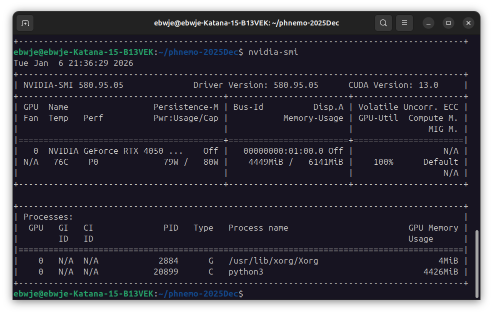

+++
date = '2026-01-06T21:57:49+08:00'
draft = false
title = '慣研究生'
+++

一個普通的週二晚上，準備跑一個 57 分鐘多的資料生成程式，將來要餵給模型用的。

寒冷的晚上，把手放在筆電風扇出口還能順便取取暖，滿方便的。

想著這 57 分鐘閒著也是閒著，請 Gemini 評估我的 GPU 狀態

Gemini:
> (上略)
> 
> 總結建議：不需要做任何更改，請保持現狀。
> 
> * 不要增加 Batch Size：改成 128 極高機率會爆顯存。
> 
> * 不要減少 Batch Size：改成 32 會導致 GPU 使用率下降（可能跌至 60-80%），導致生成總時間變長。
> 
> 
> 目前的配置 (BATCH_SIZE=64) 正在 **榨乾** 您 RTX 4050 的每一滴效能，是效率最高的狀態。

突然覺得 Gemini 像是我的助理，我像一個反派研究員。

**榨乾** 我的設備的每一滴效能，顯然不是什麼正派的手法，可以預想到做完這次專案之後，我這任勞任怨的 MSI 筆電將損失個 5 年壽命。最後這個筆電會在一次模擬中不堪重負，當機而亡。

而造成這個後果的人，正是我這萬惡的慣研究生，終端機一個指令 `python3 ldc_data_jax.py` 敲下 <kbd>Enter</kbd> 鍵，眼睛眨都不眨一下。可以說是冷血無情了。太嚇人了，自己都害怕。