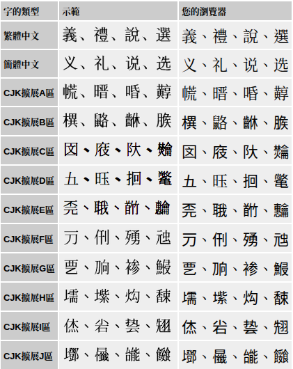

+++
date = '2026-03-10T18:39:20+08:00'
draft = false
title = '字體試驗頁'
+++

前天打開[中國哲學書電子化計劃](https://ctext.org/zh)網站的[字體試驗頁](https://ctext.org/font-test-page/zh)，如附圖，竟然多了 CJK 擴展 F ~ J 區字體。

根據[維基百科](https://en.wikipedia.org/wiki/CJK_characters)統計，共計新增 21542 字。

CJK ideographs in Unicode
|Block name| Chart range| Characters |
|---|---|---|
|[CJK Unified Ideographs](https://www.unicode.org/charts/PDF/U4E00.pdf) | 4E00–9FFF | 20992|
|CJK Unified Ideographs Extension A | 3400-4DBF | 6592|
|CJK Unified Ideographs Extension B | 20000-2A6DF | 42720|
|CJK Unified Ideographs Extension C | 2A700–2B73F | 4160|
|CJK Unified Ideographs Extension D | 2B740–2B81F | 222|
|CJK Unified Ideographs Extension E | 2B820–2CEAF | 5774|
|CJK Unified Ideographs Extension F | 2CEB0–2EBEF | 7473|
|CJK Unified Ideographs Extension G | 30000–3134F | 4939|
|CJK Unified Ideographs Extension H | 31350–323AF | 4192|
|CJK Unified Ideographs Extension I | 2EBF0–2EE5F | 662|
|CJK Unified Ideographs Extension J | 323B0–3347F | 4298|

註：Chart range 使用 16 進制編號， A = 10, B = 11, C = 12, ..., F = 15 。

**參考資料**
1. [Unicode 17.0 Character Code Charts](https://www.unicode.org/charts/)
1. [中國哲學書電子化計劃](https://ctext.org/zh)
1. [全字庫](https://www.cns11643.gov.tw/)